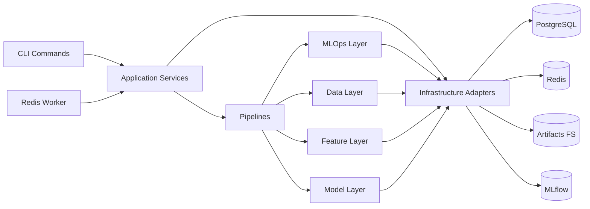
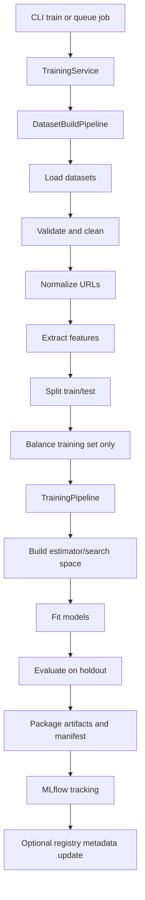
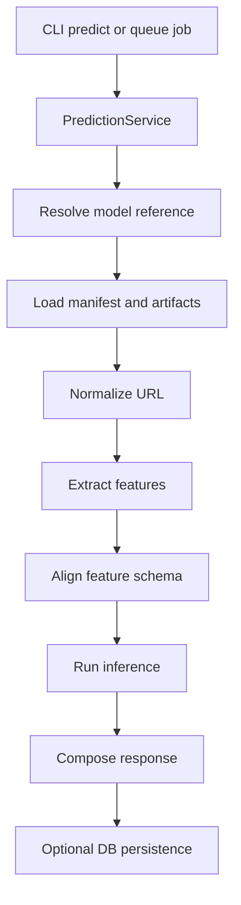
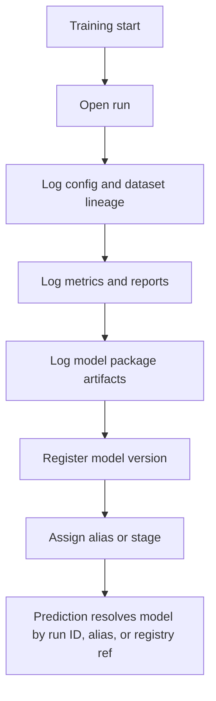

# Target Architecture

Date: 2026-07-14
Project: `semd-ml`

## Goals

- Remove cwd-dependent behavior and import-time side effects.
- Keep existing CLI and backend integrations working during migration.
- Separate dataset preparation, feature engineering, model lifecycle, and infrastructure concerns.
- Make training and inference use the same persisted metadata and feature schema.
- Support local artifacts first, with MLflow and optional database registry as external lifecycle systems.

## Architecture principles

- Prefer explicit object construction over module-level singletons.
- Make all filesystem paths repository-root-relative or config-driven.
- Keep domain logic pure where possible; isolate Redis, PostgreSQL, MLflow, and filesystem access behind adapters.
- Persist a model package manifest that fully describes feature order, preprocessing, label space, and artifact locations.
- Preserve current command names and job payload shapes until adapters are removed intentionally.

## Recommended target structure

This is a practical target, not a forced big-bang rewrite. The existing `src/` root can remain during migration, but the long-term package should be importable as `semd_ml`.

```text
semd-ml/
├── pyproject.toml
├── README.md
├── Containerfile
├── compose.yml
├── .env.example
├── configs/
│   ├── app.yaml
│   ├── features.yaml
│   ├── data_dict.yaml
│   └── logging.yaml
├── artifacts/
│   ├── models/
│   ├── reports/
│   ├── datasets/
│   └── mlflow/
├── scripts/
│   ├── data_migrate.py
│   └── feature_migrate.py
├── docs/
│   ├── investigation-report.md
│   ├── architecture.md
│   └── refactoring-plan.md
├── src/
│   ├── main.py
│   ├── verify_imports.py
│   └── semd_ml/
│       ├── __init__.py
│       ├── exceptions.py
│       ├── bootstrap.py
│       ├── config/
│       │   ├── __init__.py
│       │   ├── settings.py
│       │   ├── paths.py
│       │   └── schemas.py
│       ├── data/
│       │   ├── __init__.py
│       │   ├── loaders.py
│       │   ├── validators.py
│       │   ├── cleaners.py
│       │   ├── versioning.py
│       │   ├── splitters.py
│       │   └── repositories.py
│       ├── features/
│       │   ├── __init__.py
│       │   ├── url_normalizer.py
│       │   ├── schema.py
│       │   ├── reference_store.py
│       │   └── extractor.py
│       ├── models/
│       │   ├── __init__.py
│       │   ├── factory.py
│       │   ├── training.py
│       │   ├── evaluation.py
│       │   ├── inference.py
│       │   ├── artifacts.py
│       │   └── package_manifest.py
│       ├── mlops/
│       │   ├── __init__.py
│       │   ├── tracking.py
│       │   ├── registry.py
│       │   ├── promotion.py
│       │   └── lineage.py
│       ├── pipelines/
│       │   ├── __init__.py
│       │   ├── training_pipeline.py
│       │   ├── prediction_pipeline.py
│       │   └── dataset_build_pipeline.py
│       ├── services/
│       │   ├── __init__.py
│       │   ├── training_service.py
│       │   ├── prediction_service.py
│       │   └── worker_service.py
│       ├── interfaces/
│       │   ├── __init__.py
│       │   ├── cli/
│       │   ├── queue/
│       │   └── api_contracts.py
│       └── infra/
│           ├── __init__.py
│           ├── database.py
│           ├── redis.py
│           ├── mlflow.py
│           └── filesystem.py
└── tests/
    ├── unit/
    ├── integration/
    └── fixtures/
```

## Mapping from current modules

| Current | Target | Notes |
|---|---|---|
| `src/core/config.py` | `semd_ml/config/settings.py`, `paths.py`, `schemas.py` | Split settings, path resolution, and feature config parsing. |
| `src/data/dataset_pipeline.py` | `semd_ml/data/*`, `semd_ml/pipelines/dataset_build_pipeline.py` | Break loader, validator, cleaner, balancer, splitter apart. |
| `src/features/feature_extractor.py` | `semd_ml/features/extractor.py`, `schema.py`, `reference_store.py`, `url_normalizer.py` | Separate normalization, reference lookup, and extraction contract. |
| `src/ml/ml_pipeline.py` | `semd_ml/models/training.py`, `evaluation.py`, `inference.py`, `artifacts.py`, `factory.py` | Remove mixed training/inference/artifact responsibilities. |
| `src/ml/training_service.py` | `semd_ml/services/training_service.py`, `pipelines/training_pipeline.py` | Service coordinates I/O, pipeline performs workflow. |
| `src/ml/prediction_service.py` | `semd_ml/services/prediction_service.py`, `pipelines/prediction_pipeline.py` | Keep response shape; move artifact and inference logic out. |
| `src/tracking/mlflow_tracker.py` | `semd_ml/mlops/tracking.py`, `registry.py`, `promotion.py` | Separate run logging from registry and promotion policy. |
| `src/infra/*.py` | `semd_ml/infra/*` | Keep integrations but formalize interfaces. |
| `src/cli/*` | `semd_ml/interfaces/cli/*` | Keep current command names with thin wrappers in `src/cli`. |

## Module responsibilities

### Configuration

- Load environment, YAML config, and runtime defaults.
- Resolve project paths independent of current working directory.
- Validate algorithm, artifact, and infrastructure settings.
- Expose immutable config objects to pipelines and services.

### Dataset loading

- Load CSV/XLSX sources and extracted archive outputs.
- Normalize source column names via `data_dict`.
- Produce a canonical dataframe with `url`, `label`, and provenance fields.

### Dataset validation

- Enforce required columns, label-space validity, null handling rules, and schema checks.
- Report validation errors with dataset filename and row-level counts.
- Fail fast in training mode; support warning-only mode for migration utilities.

### Dataset cleaning

- Remove invalid URLs, duplicates, and conflicting labels according to policy.
- Normalize labels to the selected target label space.
- Emit cleaning statistics for reports and MLflow lineage.

### Dataset versioning

- Compute a dataset fingerprint from selected files, config versions, and cleaning policy.
- Persist metadata for merged datasets and extracted feature datasets.
- Decouple cache reuse from a single `merged.csv`.

### URL normalization

- Canonicalize URL strings before feature extraction and deduplication.
- Centralize lowercasing, trimming, missing-scheme handling, and parser-safe normalization.
- Ensure training and inference use the same normalization policy.

### Feature schema

- Define the canonical feature list, dtypes, defaults, and ordering.
- Version feature definitions independently from model artifacts.
- Allow backward-compatible field additions through explicit schema versions.

### Feature extraction

- Extract deterministic URL, domain, path, query, lexical, and lookup-table features.
- Load reference data through a dedicated repository with validation.
- Return structured feature rows aligned to the feature schema.

### Dataset splitting

- Split raw extracted features into train/test sets before balancing.
- Keep test data untouched.
- Support stratified split and optional evaluation seed overrides.

### Model factory

- Build algorithm-specific estimators and hyperparameter search spaces.
- Encapsulate model registry names and supported algorithms.
- Provide a single source of truth for trainable algorithms.

### Training

- Fit preprocessing and estimator pipelines on training data only.
- Run hyperparameter search, compare algorithms, and collect fit metadata.
- Persist the selected model package manifest and related artifacts.

### Evaluation

- Evaluate only on untouched holdout data.
- Compute metrics, confusion matrix, class report, and optionally calibration outputs.
- Emit machine-readable evaluation reports for CLI, MLflow, and downstream callers.

### MLflow tracking

- Start and end runs, log params/metrics/artifacts, and store lineage metadata.
- Record dataset fingerprint, feature schema version, and model package manifest.
- Avoid embedding business promotion policy inside basic run tracking.

### Model registry

- Resolve authoritative model identity across local artifacts, MLflow, and optional PostgreSQL metadata.
- Map `run_id`, registry name/version, alias, and local artifact manifest.
- Provide lookup methods used by prediction and promotion flows.

### Promotion

- Apply stage or alias transitions based on explicit policy.
- Support `candidate`, `champion`, and rollback semantics.
- Keep promotion separate from training success.

### Inference

- Load a model package manifest, align feature schema, and execute prediction.
- Return class, confidence, probabilities, and optional feature payloads.
- Surface deterministic errors for missing artifacts or schema mismatches.

### CLI

- Preserve current command names and key flags.
- Delegate to application services rather than importing global singletons.
- Provide JSON output contracts compatible with current scripts and callers.

## Target runtime boundaries

- `interfaces/cli` and `workers` accept user or queue input.
- `services` validate request-level payloads and orchestrate external side effects.
- `pipelines` implement ordered workflows.
- `data`, `features`, and `models` hold reusable domain logic.
- `mlops` manages experiment and model lifecycle.
- `infra` hides PostgreSQL, Redis, filesystem, and MLflow clients.

## Artifact strategy

The target artifact unit should be a model package, not three loosely-related files.

Recommended contents:

- `model.pkl`
- `preprocessor.pkl`
- `label_encoder.pkl` or label metadata JSON
- `feature_schema.json`
- `manifest.json`
- `training_report.json`

Recommended manifest fields:

- `model_id`
- `run_id`
- `algorithm`
- `label_space`
- `feature_schema_version`
- `feature_names`
- `dataset_fingerprint`
- `training_mode`
- `artifact_paths`
- `created_at`
- `mlflow_model_uri`
- `registry_ref`

## Compatibility architecture

- Keep `src/main.py` and `src/cli/commands/*` as compatibility wrappers during migration.
- Keep `TrainingService.execute_training(job_data)` and `PredictionService.execute_prediction(job_data)` signatures until backend callers migrate.
- Keep local artifact loading available even after MLflow registry support improves.
- Add adapters from old module imports to new package modules before removing the old files.

## Mermaid diagrams

### Target component architecture



### Training pipeline



### Prediction pipeline



### MLflow lifecycle


