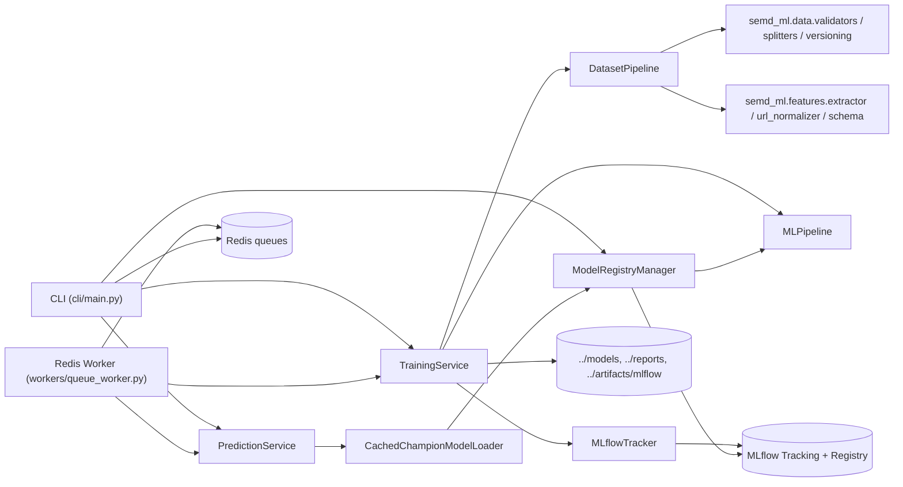
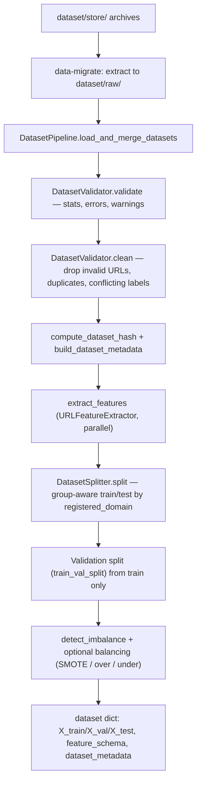
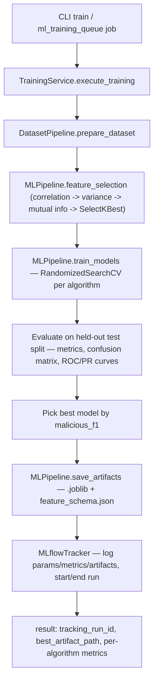
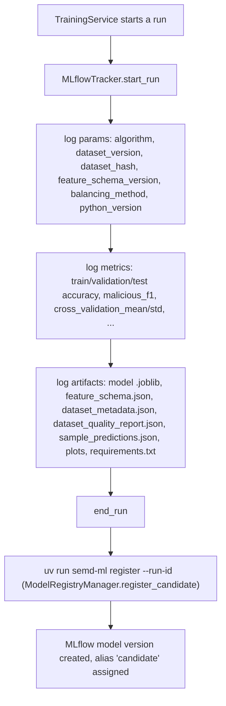
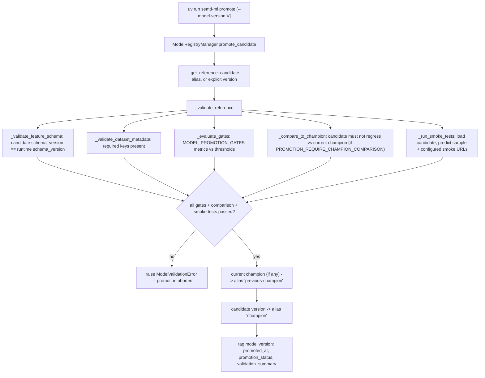
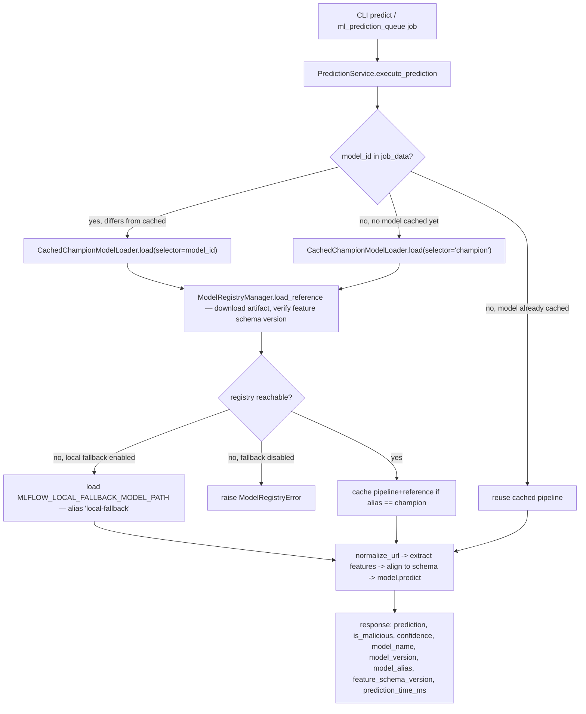

# Operations

Diagrams and workflows reflecting the **current implementation** (as opposed to `docs/architecture.md`, which
records the target/aspirational structure from the in-progress migration). Cross-checked against
`src/tracking/model_registry.py`, `src/ml/prediction_service.py`, `src/ml/training_service.py`,
`src/cli/commands/model_registry.py`, and `src/workers/queue_worker.py`.

## System component architecture



## Dataset lifecycle



Key invariants enforced by this pipeline (see `tests/unit/test_dataset_pipeline.py`):
- splitting groups by `registered_domain` so the same domain never appears in both train and test,
- balancing is applied to the training split only — validation/test stay at natural class ratios,
- the dataset hash is order-independent (sorted by `normalized_url`/`label`/`source` before hashing).

## Training workflow



`model_factory` (see `src/ml/model_factory.py`) is the single source of truth for supported algorithm identifiers
(`svm`, `random_forest`, `gradient_boosting`, and `xgboost` when the optional dependency is installed) — `decision_tree`
was retired from the identifier set.

## MLflow lifecycle



If MLflow is unavailable at training time, `MLflowTracker.start_run` fails gracefully: `execute_training` still
returns `status: success` with `tracking_run_id: null` and `tracking.enabled: false` (see
`test_mlflow_unavailable_does_not_break_training`) — training never blocks on tracking availability.

## Candidate promotion



Accuracy alone is never a promotion criterion — gates are `malicious_recall`, `malicious_f1`,
`false_negative_rate`, `prediction_latency_ms` by default (`MODEL_PROMOTION_GATES`).

## Inference flow



## Container startup

```bash
podman network create semd-shared-network   # once, before any compose file
make start                                  # docker/docker-compose.yml: ml-service + mlflow
make status
make logs LOG_SERVICE=mlflow
```

Startup order matters: `ml-service` has `depends_on: mlflow: condition: service_healthy`, so the MLflow container's
healthcheck (`curl -f http://localhost:5000`) must pass before the ML worker starts. If MLflow never reports healthy,
check `docs/troubleshooting.md`.
