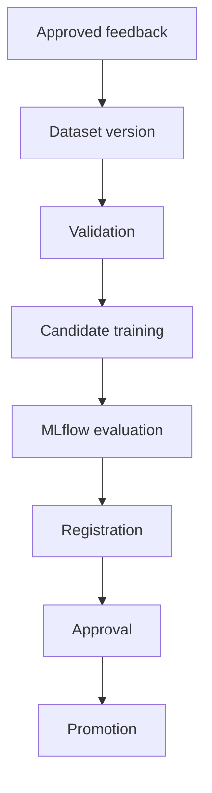

# Retraining

This is a **manual** process. There is no scheduler, cron job, or code path that trains, registers, or promotes a
model automatically. Every stage below is a human-initiated command; promotion in particular always requires an
explicit `uv run semd-ml promote` invocation after a person has reviewed the validation output.

## Workflow



### 1. Approved feedback

Collect the URLs/labels that motivate a retrain (backend-reported false positives/negatives, analyst-reviewed
submissions, newly labeled feed data). Only feedback that has gone through whatever review process the operator
mandates should be merged into the training data — this doc does not prescribe that review process, only that it
must happen before step 2.

Add the approved rows into a CSV under `src/dataset/raw/` (or a new archive under `src/dataset/store/`, then run
`make data-migrate` to extract it).

### 2. Dataset version

`DatasetPipeline.prepare_dataset` is invoked implicitly by every training run and produces a `dataset_metadata`
block containing `dataset_version`, `dataset_hash` (order-independent SHA-256 over normalized URL/label/source),
`total_records`, `benign_count`/`malicious_count`, and `source_references`. This hash is what change-detection and
audit trails should key off — a retrain with unchanged inputs reproduces the same hash.

### 3. Validation

`DatasetValidator.validate()` runs automatically as part of dataset preparation and reports (see
`docs/dataset-quality-report.md`):
- missing/empty/invalid URLs,
- missing/invalid labels,
- duplicate normalized URLs,
- conflicting labels for the same normalized URL.

`DatasetValidator.clean()` then drops invalid, duplicate, and conflicting rows before feature extraction. Review the
validation stats before proceeding — a large invalid/conflicting count usually means the new feedback needs another
look, not a code fix.

### 4. Candidate training

```bash
cd src
uv run python main.py train \
  --dataset-files dataset/raw \
  --algorithms random_forest gradient_boosting xgboost svm \
  --run-name retrain-<date>-<reason>
```

This runs the full training workflow (`docs/operations.md#training-workflow`): feature selection, per-algorithm
`RandomizedSearchCV`, evaluation on a held-out, group-aware test split, and artifact packaging. The result includes
a `tracking_run_id` if MLflow is reachable.

### 5. MLflow evaluation

Open the MLflow UI (`http://localhost:5000`) and inspect the run: per-algorithm metrics (`malicious_f1`,
`malicious_recall`, `false_negative_rate`, `prediction_latency_ms`, cross-validation mean/std), the confusion
matrix, ROC/PR curve artifacts, and the logged `feature_schema.json` / `dataset_metadata.json`. This is a manual
read of the numbers — nothing here auto-advances the run to the next stage.

### 6. Registration

```bash
uv run semd-ml register --run-id <run-id>
```

Creates an MLflow model version from the run's logged `.joblib` artifact and assigns it the `candidate` alias.
Registration does **not** evaluate promotion gates — it only makes the run addressable as a model version.

### 7. Approval

A human reviews the registered candidate: its MLflow metrics, the `validate_candidate` output (gate results, champion
comparison, smoke test predictions), and any manual spot checks against known-bad/known-good URLs. Approval is the
decision to run the promote command in step 8 — there is no separate "approve" API call; approval is exercising
judgment before invoking promotion.

```bash
uv run semd-ml promote --model-version <version>   # dry-run the gate/schema checks without approving yet:
```

Note `promote` performs validation and promotion in the same call (see `docs/operations.md#candidate-promotion`) —
if you want to see the validation result before committing, inspect the MLflow run's metrics against
`MODEL_PROMOTION_GATES` yourself first, since there is no separate `validate`-only CLI command.

### 8. Promotion

```bash
uv run semd-ml promote --model-version <version>
```

Only proceeds if:
- the candidate's feature schema version matches the runtime schema version,
- the candidate's dataset metadata has all required keys,
- every configured gate metric passes its threshold,
- the candidate does not regress vs. the current champion on the same metrics (unless
  `PROMOTION_REQUIRE_CHAMPION_COMPARISON=false`),
- smoke-test predictions on sample/configured URLs return a valid class.

On success, the current `champion` is retagged `previous-champion` and the candidate becomes `champion`. See
`docs/rollback.md` if the newly promoted model needs to be reverted.

## What this process deliberately does not do

- No automatic promotion: gate-passing never promotes a model by itself; `promote` must be invoked by a person.
- No automatic retraining trigger: nothing watches for feedback volume or drift and kicks off training.
- No silent champion replacement: promotion always preserves the previous champion under the
  `previous-champion` alias so rollback is always possible.
